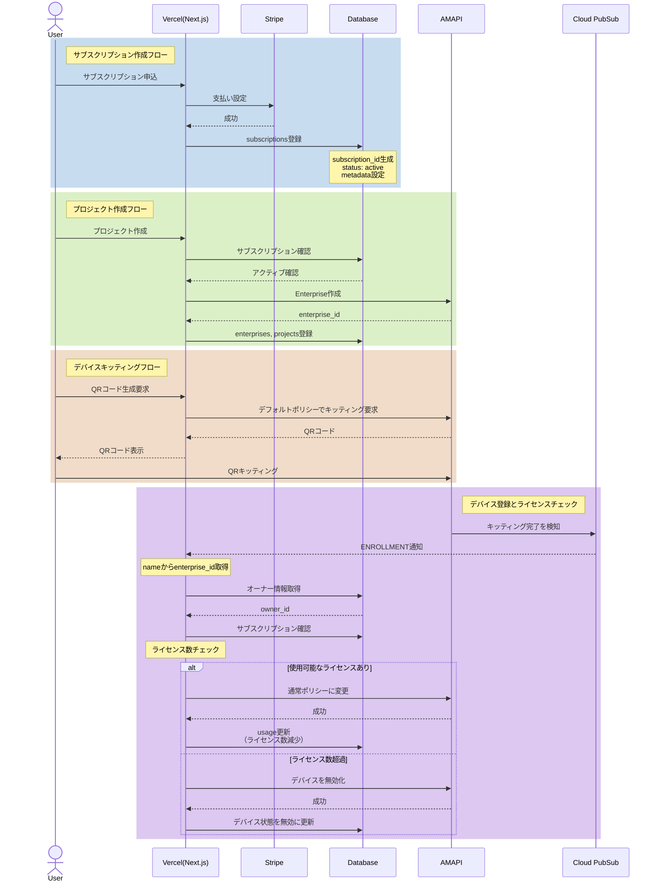

# デバイスキッティングフロー

%% ->> : 実線の矢印。リクエストや命令を表す（同期的な処理）
%% -->> : 点線の矢印。レスポンスや返答を表す（非同期的な処理）
%% alt : 条件分岐の開始
%% else : 代替パスの開始
%% end : 条件分岐の終了

```mermaid
sequenceDiagram
    actor User as User
    participant Frontend as Vercel(Next.js)
    participant Stripe as Stripe
    participant DB as Database
    participant AMAPI as AMAPI
    participant PubSub as Cloud PubSub

    %% サブスクリプション作成フロー
    rect rgb(200, 220, 240)
        Note right of User: サブスクリプション作成フロー
        User->>Frontend: サブスクリプション申込
        Frontend->>Stripe: 支払い設定
        Stripe-->>Frontend: 成功
        Frontend->>DB: subscriptions登録
        Note over DB: subscription_id生成<br/>status: active<br/>metadata設定
    end

    %% プロジェクト作成フロー
    rect rgb(220, 240, 200)
        Note right of User: プロジェクト作成フロー
        User->>Frontend: プロジェクト作成
        Frontend->>DB: サブスクリプション確認
        DB-->>Frontend: アクティブ確認
        Frontend->>AMAPI: Enterprise作成
        AMAPI-->>Frontend: enterprise_id
        Frontend->>DB: enterprises, projects登録
    end

    %% デバイスキッティングフロー
    rect rgb(240, 220, 200)
        Note right of User: デバイスキッティングフロー
        User->>Frontend: QRコード生成要求
        Frontend->>AMAPI: デフォルトポリシーでキッティング要求
        AMAPI-->>Frontend: QRコード
        Frontend-->>User: QRコード表示
        User->>AMAPI: QRキッティング
    end

    %% デバイス登録とライセンスチェック
    rect rgb(220, 200, 240)
        Note right of AMAPI: デバイス登録とライセンスチェック
        AMAPI->>PubSub: キッティング完了を検知
        PubSub-->>Frontend: ENROLLMENT通知
        Note over Frontend: nameからenterprise_id取得
        Frontend->>DB: オーナー情報取得
        DB-->>Frontend: owner_id
        Frontend->>DB: サブスクリプション確認
        Note over Frontend: ライセンス数チェック

        alt 使用可能なライセンスあり
            Frontend->>AMAPI: 通常ポリシーに変更
            AMAPI-->>Frontend: 成功
            Frontend->>DB: usage更新<br/>（ライセンス数減少）
        else ライセンス数超過
            Frontend->>AMAPI: デバイスを無効化
            AMAPI-->>Frontend: 成功
            Frontend->>DB: デバイス状態を無効に更新
        end
    end
```
